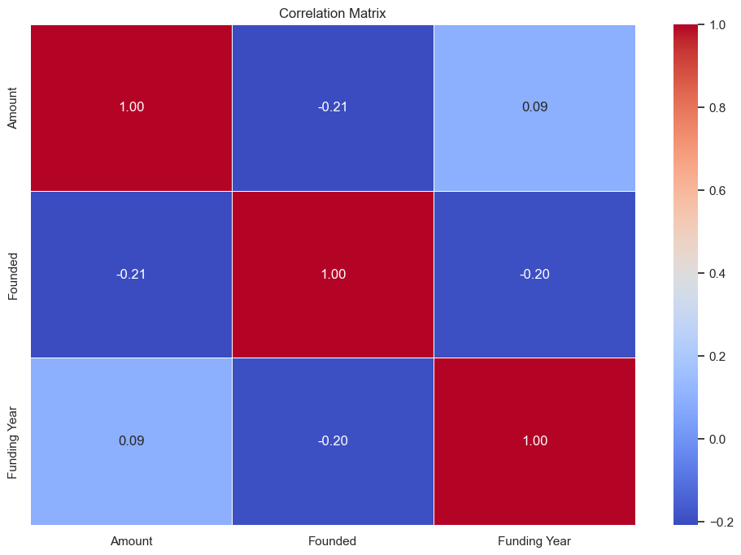

# Exploring and Visualising Indian_startup_Ecosystem 

## Introduction
A startup ecosystem comprises individuals, investors, and organizations collaborating to foster innovation, growth, and success in startups. The Indian startup environment supports entrepreneurs through mechanisms like tax reliefs, funding initiatives, and non-monetary benefits, aiming to stimulate innovation, generate employment opportunities, and attract both domestic and foreign investments. Despite governmental efforts, challenges persist within the Indian ecosystem. This article seeks to share findings from a project analyzing data spanning 2018 to 2021 in the Indian startup landscape.

## Objective
The objective of this project is to give insights to key stakeholders interested in venturing into the Indian startup ecosystem. To achieve this, we will be analyzing key metrics in funding received by startups in India from 2018 to 2021. These insights will be used by Management to make informed business decisions

## Data Description

| Column Name    | Description                                      |
|----------------|--------------------------------------------------|
| Company/Brand  | Name of the company/start-up                      |
| Founded        | Year the start-up was founded                     |
| Sector         | Sector of service provided by the company         |
| What it does   | Description of the services provided by the company |
| Founders       | Founders of the company                           |
| Investor       | Investors who have invested in the company        |
| Amount($)      | Amount of funding raised by the company in dollars |
| Stage          | Round of funding reached by the company            |

## Data Cleaning 

- Inconsistent data for each year
- Complex data cleaning process
- Overcoming inconsistencies in the datase

## Exploratory Data Analysis: EDA

### Univariate Analaysis 

### Multivariate Analysis 

## Hypothesis development 

✨ NULL: Technological industries do not have a higher success rate of being funded

✨ ALTERNATE: Technological industries have a higher success rate of being funded

## Business Questions 

## Key Findings :mag_right:

✨ The type of industry has an impact on the success of getting funded. 

Fintech and edtech sectors are the most frequently funded startup solutions.

✨ Location can affect the success of receiving funding.

Bangalore leads in startup funding with approximately $26,210,250,000 total investment commitments.

✨ Start-ups receive more funding at the seed stage, indicating its significance in attracting investments

✨ Inflection Point Ventures emerges as the top investor, actively investing in numerous startups in India.

## Major Conclusions 

## Key Insights 

✨ India's startup ecosystem is positive and thriving with strong favor towards technological companies.

✨ Equal opportunities exist for non-technological sectors as well.

✨ Fintech and edtech sectors are particularly active in the Indian startup ecosystem.

✨ Mumbai is at the forefront of these developments in fintech and edtech sectors.

✨ Non-technical industries have a few large investments that skew the mean higher.

✨ Technical industries have a larger number of smaller investments, driving up the sum.

The Indian startup ecosystem is a vibrant and influential force in the global market. This project provides valuable insights into funding patterns and industry preferences. By leveraging this information, stakeholders can make informed decisions and contribute to the growth and success of startups in India.

## Author

`Umar Fawaz`

`Data Analyst`

Read more on my Medium blog: [Medium Article] (https://medium.com/@umarfawaz77/unveiling-the-dynamics-of-indias-startup-ecosystem-a-journey-from-2018-to-2021-8c6deae0cc30)